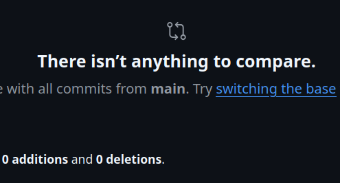

# Lab 8 — Report

Paste your checkpoint evidence below. Add screenshots as image files in the repo and reference them with ``.

## Task 1A — Bare agent

**"What is the agentic loop?"**

The agent responded:

> The agentic loop is the iterative cycle that enables an AI agent to act autonomously:
>
> 1. **Perceive** — Understand the goal and current environment state.
> 2. **Think** — Plan the next step or decide on an action.
> 3. **Act** — Execute a tool, run code, or interact with the environment.
> 4. **Observe** — Analyze the result of that action.
> 5. **Repeat** — Loop back to step 2 until the goal is achieved or a stopping condition is met.
>
> This loop allows agents to handle multi-step tasks, self-correct on errors, and adapt dynamically, rather than just producing a single static response.

**"What labs are available in our LMS?"**

The agent responded with 8 labs from the LMS backend:

> Here are the 8 labs currently available in your LMS:
>
> 1. Lab 01 – Products, Architecture & Roles
> 2. Lab 02 — Run, Fix, and Deploy a Backend Service
> 3. Lab 03 — Backend API: Explore, Debug, Implement, Deploy
> 4. Lab 04 — Testing, Front-end, and AI Agents
> 5. Lab 05 — Data Pipeline and Analytics Dashboard
> 6. Lab 06 — Build Your Own Agent
> 7. Lab 07 — Build a Client with an AI Coding Agent
> 8. Lab 08 — lab-08

## Task 1B — Agent with LMS tools

**"What labs are available?"**

> Here are the 8 labs currently available in your LMS:
> 1. Lab 01 – Products, Architecture & Roles
> 2. Lab 02 — Run, Fix, and Deploy a Backend Service
> 3. Lab 03 — Backend API: Explore, Debug, Implement, Deploy
> 4. Lab 04 — Testing, Front-end, and AI Agents
> 5. Lab 05 — Data Pipeline and Analytics Dashboard
> 6. Lab 06 — Build Your Own Agent
> 7. Lab 07 — Build a Client with an AI Coding Agent
> 8. Lab 08 — lab-08

**"Is the LMS backend healthy?"**

The agent called the `lms_health` MCP tool and responded:

> Yes, the LMS backend is healthy — 56 items loaded, no errors.

## Task 1C — Skill prompt

**"Show me the scores"** (without specifying a lab)

The agent called `lms_labs` first, then `lms_completion_rate` for all labs, detected stale data, triggered `lms_sync_pipeline`, and re-queried:

> Here's the completion overview across all labs:
>
> | Lab | Title | Completion | Passed / Total |
> |-----|-------|-----------|----------------|
> | Lab 01 | Products, Architecture & Roles | 96.4% | 186 / 193 |
> | Lab 02 | Run, Fix, and Deploy a Backend Service | 90.3% | 112 / 124 |
> | Lab 03 | Backend API: Explore, Debug, Implement, Deploy | 76.9% | 10 / 13 |
> | Lab 04 | Testing, Front-end, and AI Agents | 0.0% | 0 / 0 |
> | Lab 05 | Data Pipeline and Analytics Dashboard | 0.0% | 0 / 0 |
> | Lab 06 | Build Your Own Agent | 0.0% | 0 / 0 |
> | Lab 07 | Build a Client with an AI Coding Agent | 0.0% | 0 / 0 |
> | Lab 08 | lab-08 | 0.0% | 0 / 0 |
>
> Labs 01–03 have submissions, while Labs 04–08 haven't received any yet. Want me to dive deeper into any specific lab — pass rates per task, group performance, top learners, or submission timeline?

## Task 2A — Deployed agent

<!-- Paste a short nanobot startup log excerpt showing the gateway started inside Docker -->

## Task 2B — Web client

<!-- Screenshot of a conversation with the agent in the Flutter web app -->

## Task 3A — Structured logging

<!-- Paste happy-path and error-path log excerpts, VictoriaLogs query screenshot -->

## Task 3B — Traces

## Task 3C — Observability MCP tools

<!-- Paste agent responses to "any errors in the last hour?" under normal and failure conditions -->

## Task 4A — Multi-step investigation

<!-- Paste the agent's response to "What went wrong?" showing chained log + trace investigation -->

## Task 4B — Proactive health check

<!-- Screenshot or transcript of the proactive health report that appears in the Flutter chat -->

## Task 4C — Bug fix and recovery

<!-- 1. Root cause identified
     2. Code fix (diff or description)
     3. Post-fix response to "What went wrong?" showing the real underlying failure
     4. Healthy follow-up report or transcript after recovery -->
